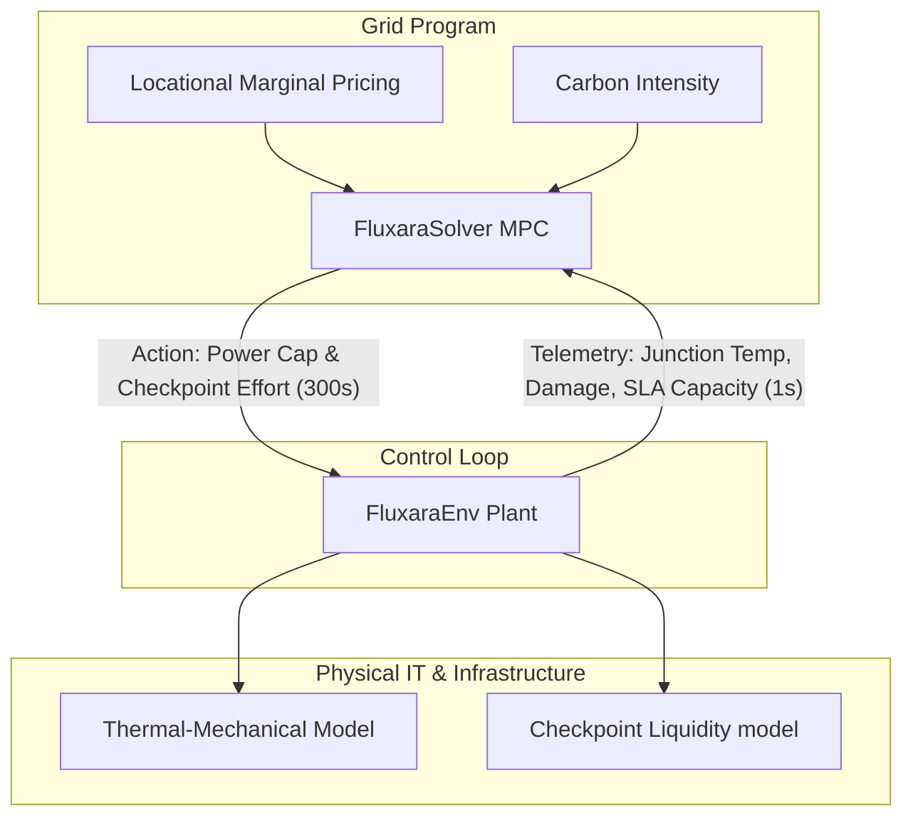

# Fluxara Architecture Specification

Fluxara is a hierarchical, grid-interactive AI control plane designed to transform dense GPU compute clusters into contractable, flexible grid assets. By coupling mathematical models of power systems, thermal-mechanical fatigue, and distributed machine learning schedulers, Fluxara enables real-time optimization of energy-compute facilities.

---

## 1. Cyber-Physical System Decoupling

Data centers have traditionally been operated as static, peak-provisioned loads. Under Fluxara, the data center is managed as a dynamically responsive grid asset. To make this safe, the architecture decouples fast physical thermal realities from slower economic market cycles.

---

## 2. Multi-Rate Clock Resolution

A core architectural challenge in co-optimizing energy and compute is the mismatch of physical and financial timescales:
- **Financial/Grid Market Step ($\Delta t_{market} = 300\text{s}$):** Electricity pricing (e.g., CAISO 5-minute real-time LMP) and carbon metrics update every 5 minutes. The solver runs at this interval to output optimal power allocation ($u_k$) and checkpoint scheduling efforts ($c_k$).
- **Physical/Thermal Step ($\Delta t_{phys} = 1\text{s}$):** Server junction temperatures ($T_j$), checkpoint age, and thermal gradients transiently change in seconds. The physical environment steps forward in 1-second ticks.

During each 5-minute market interval $k$, the environment runs 300 iterations of 1-second simulation updates to integrate the physical equations under the current action setpoint.

---

## 3. Convex Controller vs. Nonlinear Physical Ledger

To ensure deterministic, sub-millisecond execution times suitable for real-time control, the optimization problem must remain strictly convex. Fluxara achieves this by decoupling the **solver representation** from the **physical ledger accounting**:

### A. Environment Physical Ledger (Nonlinear)
The physical plant is simulated with high-fidelity, nonlinear physics in `env.py`:
- **First-Order RC Junction Temperature ($T_j$):**
  $$T_{j, t+1} = T_{j, t} + \alpha \left[ T_{amb} + R_{\theta} P_t - T_{j, t} \right]$$
  where $\alpha = 1 - e^{-\Delta t / \tau}$, representing the thermal time constant ($\tau = 45\text{s}$).
- **Coffin-Manson Thermal-Fatigue Damage ($D$):**
  Accumulates whenever a change in the power cap setpoint creates a thermal excursion:
  $$\Delta D = \frac{1}{N_f} = \frac{(\Delta T)^c}{C}$$
  where $c = 5.0$ and $C = 1.0\times 10^{12}$. The nonlinear exponent makes it non-convex.
- **Creep/Dwell Damage:**
  Adds a penalty if $T_j$ dwells above a safety threshold (e.g., $75^\circ\text{C}$).

### B. Solver Formulation (Convex QP)
The MPC optimizer in `solver.py` uses a convex quadratic proxy to penalize thermal and mechanical fatigue, making it highly compatible with QP solvers like `OSQP`:
- **Fatigue Proxy Cost:**
  $$C_{\text{fatigue-proxy}} = \lambda_{fatigue} \sum_{t} (u_t - u_{t-1})^2$$
  This quadratic penalty on power setpoint changes ($u_t - u_{t-1}$) prevents the controller from scheduling rapid power swings without overcomplicating the math.
- **Continuous Checkpoint Relaxation:**
  Instead of solving an NP-hard Mixed-Integer Program (MILP) to decide which specific jobs to checkpoint, the solver relaxes this into a continuous variable $c_t \in [0, 1]$ representing the "checkpoint effort". The network congestion penalty is modeled quadratically ($b \sum c_t^2$) to reflect the performance penalties of "checkpoint storms."

---

## 4. Telemetry and State Space

The environment exposes a standardized telemetry observation vector to the solver:

| Parameter | Type | Unit | Description |
| :--- | :--- | :--- | :--- |
| `t_s` | `int` | s | Accumulated elapsed physical time. |
| `market_idx` | `int` | - | Index of the current 5-minute market interval. |
| `power_frac` | `float` | - | Current power cap setpoint ($u_k \in [0.55, 1.0]$). |
| `tj_c` | `float` | °C | Simulated representative GPU junction temperature. |
| `damage_fraction` | `float` | - | Cumulative physical lifetime damage index ($D \in [0, 1]$). |
| `checkpoint_age_s` | `float` | s | Elapsed time since the last successful distributed checkpoint. |
| `interruptible_frac` | `float` | - | Proportion of the workload that can be immediately shed without losing unsaved progress. |
| `lmp_usd_per_mwh` | `float` | $/MWh | Locational Marginal Price of the local grid node. |

---

## 5. Main Execution Flow

For each simulation run (typically 288 steps representing 24 hours):
1. **Initialize:** Instantiate `FluxaraEnv` and `FluxaraSolver`.
2. **Observe:** Retrieve initial state.
3. **Loop:**
   - Call `env.forecast(horizon)` to retrieve CAISO prices and carbon forecasts.
   - Run `solver.solve(obs, forecast)` to resolve the convex optimization problem.
   - Pass the optimal first-step action (Power Cap, Checkpoint Effort) into `env.step_market(action)`.
   - The environment steps forward 300 times at 1-second resolution, integrating thermal equations and logging hardware fatigue.
   - Transition to the next market step.
4. **Collect History:** Export logs to `fluxara_history.csv` for post-run audits.
